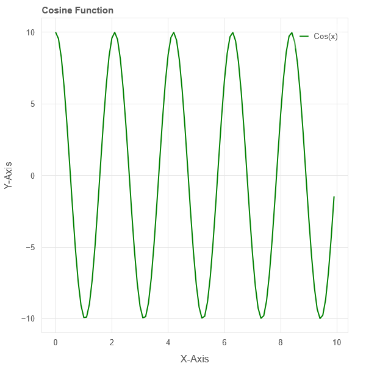

# Bokeh
Some small Tests with Bokeh in Python.

https://bokeh.org/

## 01_simple_plot.py

Simple plotting of 3 graphs. Sin, Cos and Tan.



## 02_server_plot.py

Example Server File from the bokeh documentation. Requires a bokeh server. Execute the server with the following command: 
```
bokeh serve --show server_plot.py
```


