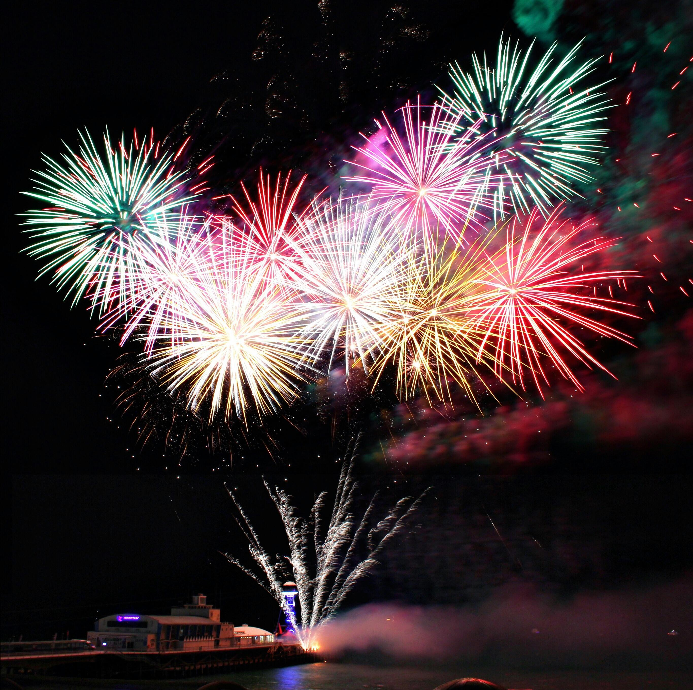
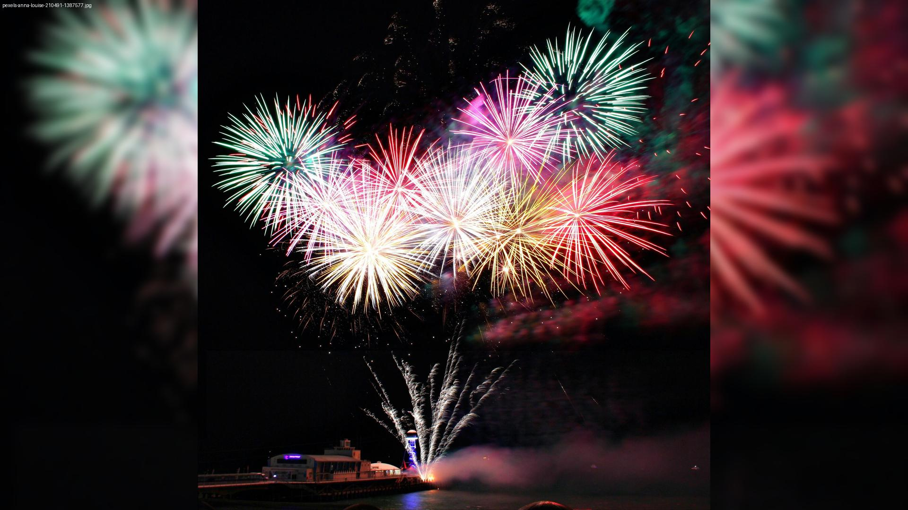

# Image Slideshow
Converts images with different aspect ratios into 16 by 9 images with blurred background. Images are not cropped. A small watermark with the original filename is added in the image corner.

The python file takes a folder path as a argument. A subfolder named 'converted' gets created and all converted files are stored in this folder.

## Before Editing

## After Editing
